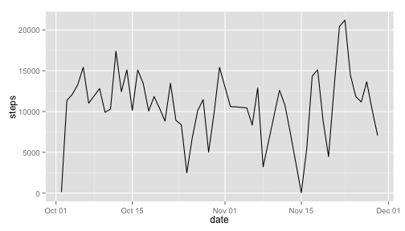
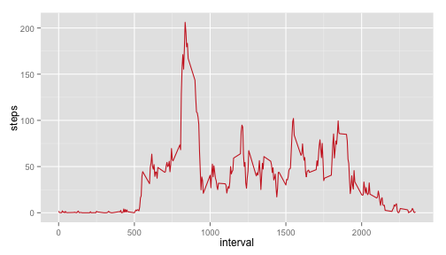
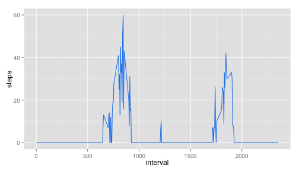
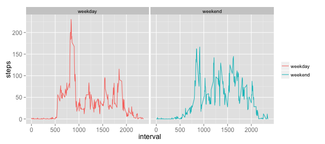

# Reproducible Research: Peer Assessment 1


## Loading and preprocessing the data

```r
activity <- read.csv("activity.csv")
```


## What is mean total number of steps taken per day?


* First filter the data with no NAs then calculate the total number of steps taken per day.

```r
filtered <- activity[!is.na(activity$steps), ]
head(filtered)
```

```
##     steps       date interval
## 289     0 2012-10-02        0
## 290     0 2012-10-02        5
## 291     0 2012-10-02       10
## 292     0 2012-10-02       15
## 293     0 2012-10-02       20
## 294     0 2012-10-02       25
```

```r
summary(filtered)
```

```
##      steps               date          interval   
##  Min.   :  0.0   2012-10-02:  288   Min.   :   0  
##  1st Qu.:  0.0   2012-10-03:  288   1st Qu.: 589  
##  Median :  0.0   2012-10-04:  288   Median :1178  
##  Mean   : 37.4   2012-10-05:  288   Mean   :1178  
##  3rd Qu.: 12.0   2012-10-06:  288   3rd Qu.:1766  
##  Max.   :806.0   2012-10-07:  288   Max.   :2355  
##                  (Other)   :13536
```

```r
str(filtered$date)
```

```
##  Factor w/ 61 levels "2012-10-01","2012-10-02",..: 2 2 2 2 2 2 2 2 2 2 ...
```

```r
library(lubridate)
filtered$date <- ymd(filtered$date)
str(filtered$date)
```

```
##  POSIXct[1:15264], format: "2012-10-02" "2012-10-02" "2012-10-02" "2012-10-02" ...
```

```r
steps.everyday <- sapply(split(filtered$steps, filtered$date), sum)
uni.dates <- unique(filtered$date)
steps.per.day <- data.frame(uni.dates, steps.everyday)
names(steps.per.day) <- c("date", "steps")
head(steps.per.day)
```

```
##                  date steps
## 2012-10-02 2012-10-02   126
## 2012-10-03 2012-10-03 11352
## 2012-10-04 2012-10-04 12116
## 2012-10-05 2012-10-05 13294
## 2012-10-06 2012-10-06 15420
## 2012-10-07 2012-10-07 11015
```


* Plot steps taken per day

```r
hist(steps.per.day$steps, breaks = seq(0, 25000, 2500), xaxt = 'n', 
     main = "Histogram of steps taken each day")
axis(side = 1, at = seq(0, 25000, 2500))
```


```r
library(ggplot2)
qplot(x = date, y = steps, data = steps.per.day, geom = "line")
```




* Calculate the mean and median total number of steps taken per day

```r
print(paste("the mean is:", mean(steps.everyday)))
```

```
## [1] "the mean is: 10766.1886792453"
```

```r
print(paste("the median is:", median(steps.everyday)))
```

```
## [1] "the median is: 10765"
```


## What is the average daily activity pattern?

* Generate two corresponding daily pattern data frames concerning the mean and median of steps taken with respect of the time interval identifier

```r
library(reshape2)
act.melt <- melt(activity, id = c("interval", "date"), 
                 measure.vars = "steps")
pattern.mean <- dcast(act.melt, interval ~ variable, mean, na.rm = T)
pattern.median <- dcast(act.melt, interval ~ variable, median, na.rm = T)
head(pattern.mean)
```

```
##   interval   steps
## 1        0 1.71698
## 2        5 0.33962
## 3       10 0.13208
## 4       15 0.15094
## 5       20 0.07547
## 6       25 2.09434
```

```r
head(pattern.median)
```

```
##   interval steps
## 1        0     0
## 2        5     0
## 3       10     0
## 4       15     0
## 5       20     0
## 6       25     0
```


* Plot the two graphs

```r
ggplot(aes(x = interval, y = steps), data = pattern.mean) +
    geom_line(color = "firebrick3")
```



```r
ggplot(aes(x = interval, y = steps), data = pattern.median) +
    geom_line(color = "dodgerblue2")
```




* Infer which 5-minute interval, on average across all the days in the dataset, contains the maximum number of steps.

```r
ordered.pattern <- pattern.mean[order(pattern.mean$steps, decreasing = T), ]
head(ordered.pattern)
```

```
##     interval steps
## 104      835 206.2
## 105      840 195.9
## 107      850 183.4
## 106      845 179.6
## 103      830 177.3
## 101      820 171.2
```


*Interval 835 contains the maximum number of steps*


## Imputing missing values

```r
na.number <- table(complete.cases(activity))[["FALSE"]]
```
*the total number of missing values in the dataset is 2304*

I'm using the mean for the particular 5-minute interval to fill in the missing value

```r
activity.full <- activity
activity.full$date <- ymd(activity.full$date)
indice <- which(is.na(activity.full$steps))
for(i in 1:length(activity.full[indice, ]$steps)){
    activity.full[indice, ]$steps[i] <- 
        pattern.mean[pattern.mean$interval == 
                         activity.full[indice, ]$interval[i], ]$steps
}
```
* Histogram of the total number of steps taken each day

```r
full.steps.everyday <- sapply(split(activity.full$steps, 
                                    activity.full$date), sum)
range(full.steps.everyday)
```

```
## [1]    41 21194
```

```r
hist(full.steps.everyday, breaks = seq(0, 25000, 2500), xaxt="n", 
     main = "Histogram of steps taken per day with data filled in")
axis(1, at = seq(0, 25000, 2500))
```


* Calculate the mean and median of steps taken per day

```r
ans1 <- as.character(round(mean(full.steps.everyday)))
ans2 <- as.character(round(median(full.steps.everyday)))
```
*The mean is 10766. The median is 10766*
*The relative distribution changes and the overall steps taken increases*

## Are there differences in activity patterns between weekdays and weekends?
* Melt and cast the data then plot

```r
activity.full$dob <- tolower(weekdays(activity.full$date))
for(i in 1:nrow(activity)){
    if(activity.full$dob[i] == "saturday" | 
           activity.full$dob[i] == "sunday"){
        activity.full$week[i] <- "weekend"
    }else{
        activity.full$week[i] <- "weekday"
    }
}
activity.full$week <- factor(activity.full$week)

full.melt <- melt(activity.full, id = c("interval", "date", "week"), 
                 measure.vars = "steps")
new.pattern <- dcast(full.melt, interval + week ~ variable, mean)

ggplot(aes(x = interval, y = steps), data = new.pattern) +
    geom_line(aes(color = week)) + facet_wrap( ~week) +
    theme(legend.title=element_blank(),  axis.text=element_text(size=12),
        axis.title=element_text(size=14))
```



