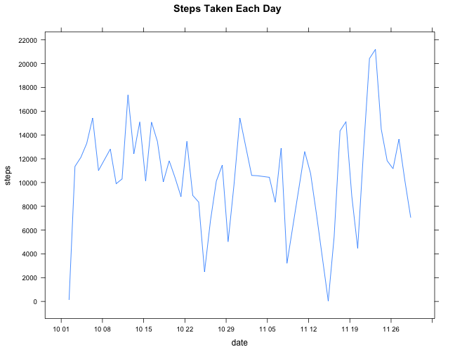

# Reproducible Research: Peer Assessment 1


## Loading and preprocessing the data

```r
activity <- read.csv("activity.csv")
```


## What is mean total number of steps taken per day?

* First filter the data with no NAs then calculate the total number of steps taken per day.

```r
filtered <- activity[!is.na(activity$steps), ]
head(filtered)
```

```
##     steps       date interval
## 289     0 2012-10-02        0
## 290     0 2012-10-02        5
## 291     0 2012-10-02       10
## 292     0 2012-10-02       15
## 293     0 2012-10-02       20
## 294     0 2012-10-02       25
```

```r
summary(filtered)
```

```
##      steps               date          interval   
##  Min.   :  0.0   2012-10-02:  288   Min.   :   0  
##  1st Qu.:  0.0   2012-10-03:  288   1st Qu.: 589  
##  Median :  0.0   2012-10-04:  288   Median :1178  
##  Mean   : 37.4   2012-10-05:  288   Mean   :1178  
##  3rd Qu.: 12.0   2012-10-06:  288   3rd Qu.:1766  
##  Max.   :806.0   2012-10-07:  288   Max.   :2355  
##                  (Other)   :13536
```

```r
str(filtered$date)
```

```
##  Factor w/ 61 levels "2012-10-01","2012-10-02",..: 2 2 2 2 2 2 2 2 2 2 ...
```

```r
library(lubridate)
filtered$date <- ymd(filtered$date)
str(filtered$date)
```

```
##  POSIXct[1:15264], format: "2012-10-02" "2012-10-02" "2012-10-02" "2012-10-02" ...
```

```r
steps.everyday <- sapply(split(filtered$steps, filtered$date), sum)
uni.dates <- unique(filtered$date)
steps.per.day <- data.frame(uni.dates, steps.everyday)
names(steps.per.day) <- c("date", "steps")
head(steps.per.day)
```

```
##                  date steps
## 2012-10-02 2012-10-02   126
## 2012-10-03 2012-10-03 11352
## 2012-10-04 2012-10-04 12116
## 2012-10-05 2012-10-05 13294
## 2012-10-06 2012-10-06 15420
## 2012-10-07 2012-10-07 11015
```

* Plot steps taken per day

```r
library(lattice)
xyplot(steps ~ date, data = steps.per.day, type = "l", main = "Steps Taken Each Day", scales = list(tick.number = 10))
```

 


## What is the average daily activity pattern?


## Imputing missing values


## Are there differences in activity patterns between weekdays and weekends?
